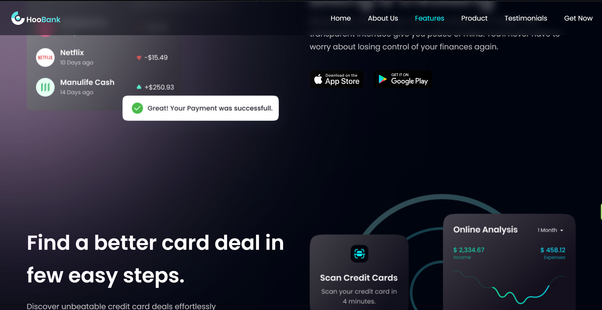

# About
It's a landing page for a modern banking system.

## Tech

<div align="center">
  
  
  
  
</div>

* React
* Tailwind
* Vite
* build and deployed to Netlify

## Live
[](https://app.netlify.com/sites/bank-of-the-future/deploys)

[Deployed to Netlify](https://bank-of-the-future.netlify.app/)

## Design
This landing page was developed based on the design in Figma: [link](https://www.figma.com/community/file/1227560835659149296), but I took the freedom to adjust some parts to make it look more credible and realistic. Like, e.g.: 
* using dots instead of commas for the decimals
* adjusting the transcation amounts in one graphic to be more reasonable
* writing a more credible copy than Lorem ipsum filler text
* fixed some typos
* deisgned hover and active states and animations



### Navbar

* hides upon scrolling down, and shows up when the user scrolls upwards
* the active section is highlighted

```jsx
const [activeLink, setActiveLink] = useState('');
const [prevScrollPos, setPrevScrollPos] = useState(0);
const [visible, setVisible] = useState(true);

const handleScroll = () => {
    //determine current scroll position
    const currentScrollPos = window.scrollY;

    // determine the scroll direction
    const isScrollingDown = currentScrollPos > prevScrollPos;

    //hide navbar when scrolling down
    setVisible(isScrollingDown ? false : true);

    // Save the current scroll position for the next comparison
    setPrevScrollPos(currentScrollPos);

    // Get all section elements
    const sections = document.querySelectorAll('section');

    // Find the section in view to make it active
    let currentSection = '';
    sections.forEach((section) => {
      const rect = section.getBoundingClientRect();
      if (rect.top <= 0 && rect.bottom > 0) {
        currentSection = section.id;
      }
    });

    // Update the active link
    setActiveLink(currentSection);
  };
```

### Statistics

* numbers animate

```jsx
const animateNumbers = () => {
      const interval = animationDuration / 50;

      stats.forEach((stat, index) => {
        const step = stat.value / (animationDuration / interval);
        let currentCount = 0;

        const intervalId = setInterval(() => {
          currentCount += step;
          setAnimatedStats((prevStats) => [
            ...prevStats.filter((prevStat) => prevStat.id !== stat.id),
            {
              ...stat,
              animatedValue: index === 2 ? `$${Math.round(currentCount)}M+` : `${Math.round(currentCount)}+`,
            },
          ]);

          if (currentCount >= stat.value) {
            clearInterval(intervalId);
          }
        }, interval);
      });
    };
```

## Useful resources

The idea to build this page and practice React and Tailwind came from JavaScript Mastery [video on YouTube](https://www.youtube.com/watch?v=_oO4Qi5aVZs&ab_channel=JavaScriptMastery)